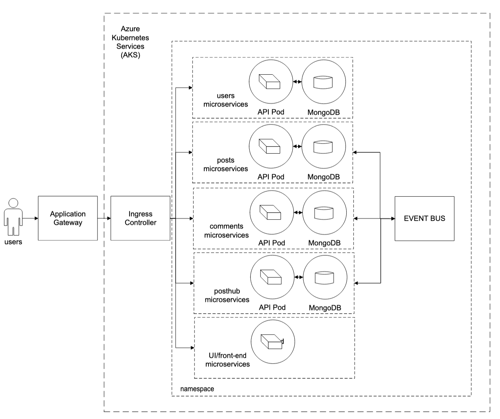

# Azure Kubernetes Service (AKS): Deploying Microservices

This repository implements a Blog web application. In this application, user can post, post of commments, and register to the website. The application is implemented considering the microservice deployement, where each feature is designed, tested, and depoyed isolated from other features. Threfore, the following microservices are developed for the web application: 

* `ui` -> provides the user interface (front-end)
* `posts` -> users can create posts (back-end)
* `comments` -> users can comment on their own posts and other user posts (back-end)
* `users` -> registration of new users (back-end)
* `posthub` -> sign in, sign out, routes, mongo DB (back-end)




Besides, we cover the following aspects during the design and development of this web application.

* k8s manifest
* software delivery automation via azure DevOps CI/CD
* k8s integration with application gateway
* azure container registry (ACR)
* certification management (cert-manager)
* scalability and availability
* highly available and fault tolerant


## Technology stack ##

* In the front-end we're using `nextjs`
* In the backend we're using `node-js/Express`

## Build the images for back-end and front-end microservices
* build images for ```ui```
* build images for ```users```
* build images for ```comments```
* build images for ```posthub```


## Script deployment 
1. Deploy the aks via ```scripts/aks_deploy.md```
2. Create the ACR via ```scripts/acr_deploy.md```
3. Create the application gateway via ```scripts/appgw_deploy.md```
4. Deploy the certificates via ```scripts/certmgr_deploy.md```
5. Deploy the application via ```scripts/app_deploy.md``` and ```demo-ui.yaml```
6. Implement CI/CD via ```scripts/ci_pipeline``` and ```scripts/cd_pipeline```

## Azure DevOps Repos 
- create a project at azure DevOps
- Go to Repos and Push an existing repository from command line
- Upload the code to Azure DevOps Repos

## Setup the K8S ingress service

- go to azure portal and get the IP of `appgw-01`. 
- Then replace it into `spec/tls` and `spec/rule/hosts` in `k8s/prod-manifest/ingress-service.yaml`
- modify the ip in the **ENV VARIABLE** (`NEXT_PUBLIC_SITE_URL`) for the UI application in `ui/.env`
- make sure to commit this change to Azure DevOps Repos 

## Setup Pipelines

From Azure `DevOps Repos`, create a branch dev from master, and another branch named test from dev.

Let's prevent direct push to branches test and dev. Therefore, configure pull requests to those branches. 
To do so:
- go to branch policies in `Repos/Branches/BranchPolicies` in for branches `master`, `dev`, `test`, 
    - turn Require a minimum number of reviewers on and set 1 to Minimum number of reviewers, 
    - and set mark Allow requestors to approve their own changes if you're the only one working on this project. 

## Configure a pipeline template for UI microservice (CI) ##
- Go to pipelines in the project and create a new pipeline. 
- Select Use the classic editor and confirm if the right repo and directory is selected. 
- Now, choose the docker container template and click apply. 
- Select ubuntu latest as agent classification
- Click on build an image:
    - Select the azure subscription 
    - In docker file field replace ** by $(microservice)
    - In image name field replace the variables with: 
        ```
        $(Build.Repository.Name)-$(Build.SourceBranchName)-$(microservice):$(Build.BuildId)
        ```

- Click on push an image:
    - Select azure subscription
    - Select the azure container registry and specify the acr id
    - In image name field replace the variables with:
        ```
        $(Build.Repository.Name)-$(Build.SourceBranchName)-$(microservice):$(Build.BuildId)
        ```

- Rename the pipeline, e.g., `aks-ci-ui`
- Click on save and queue, then save

- Now, we need to define a replace to substitute variables in the manifest of our microservices
    - click add on the right of agent job and search for replace tokens, then add it
    - select the replace tokens feature and modify:
        - add to target files: 
            ```
            $(k8sFolder)/prod-manifests/$(microservice).yaml
            $(k8sFolder)/prod-manifests/$(ingressTokenizedYamlFile)
            $(k8sFolder)/$(natsTokenizedYamlFile)
            $(k8sFolder)/$(microservice)-mongo.yaml
            ui/.env
            ```
        - click on token pattern and select custom
        - in token prefix specify --
        - in token sufix specify --
        - in validation section 
            - select action on missing variable and specify fail
            - select action on no file processed variable and specify fail
        - in advanced section:
            - change default to ```-$(Build.SourceBranchName)```

- Drag and drop the replace tokens to the top (before build an image)

- Add a new tab replace the image tab in the manifest file
    - click add on the right of agent job and search for replace tokens, then add it
    - drag it and drop to the bottom
    - change target file variable to ```$(k8sFolder)/prod-manifest/$(microservice).yaml```
    - change token pattern to ```__...__```
    - in validation section select fail for action on missing variable and action on no file processed
    - in advance section set the default value to acr id, e.g., 
        ```
        ID.azurecr.io/$(Build.Repository.Name)-$(Build.SourceBranchName)-$(microservice):$(Build.BuildId)
        ```
        
- Add a new tab to copy the modified files from our source folder to a target folder and publish the copied files for a user in a released pipeline
    - add a new tab and select copy files
    - add a new tab and select publish build artifacts
    - Select the copy files task 
        - in content replace the value with the files we need to copy: 
            ```
            $(k8sFolder)/prod-manifests/$(microservice).yaml
            $(k8sFolder)/prod-manifests/$(ingressTokenizedYamlFile)
            $(k8sFolder)/$(natsTokenizedYamlFile)
            $(k8sFolder)/$(microservice)-mongo.yaml
            ui/.env
            ```
        - in target folder specify ```$(build.artifactstagingdirectory)```
        - in advanced section select override and flatten folders

    - Select publish artifacts task 
        - confirm that patht to publish is ```$(Build.ArtifactStagingDirectory)```

- Select all tasks and create a task group, e.g, ```aks-ci-task-template```
    - In ingressTokenizedYamlFile: ```ingress-service.yaml```
    - in k8sFolder: ```k8s```
    - in microservice: ```blank```
    - in natsTokenizedYamlFile: ```nats-eventhub.yaml```
    - then create.

- After that, select the task group created and change the microservice to ```ui```
- Click on save and queue button and select save and run
- Click on the agent job to review the task
- Check the artifacts by:    
    - click on agent job
    - click on the artifact link
    - expand drop folder
    

## creating pipeline for backend microservices ##
- go to pipelines and select edit
- go to triggers tab and check (mark) enable container integration
- in branch filters section
    - add and select ```test``` branch
    - add and select ```dev``` branch

- in path filters section
    - add and specify in type: include and in path selection: ```ui```

- save and queue option and save

## pipeline for users microservices ##
- go to pipelines and select new pipeline
- select the classic editor option
- confirm the right repository and branch(```main```), then click continue
- on the right, select empty job
    - on the pipeline, select ```ubuntu-latest``` in agent specification
    - click add buton on right of agent job
        - select the task group ```aks-ci-task-template```
        - click on the created task group and redefine the name of the microservice to ```users```
        - rename the pipeline to ```aks-ci-users```
        - now lets set an automatic build for users microservices:
            - click the triggers tab and on the right select enable continous integration
            - in branch filters make sure to include the branches ```main```, ```test```, and ```dev```
            - in path filters specify ```users```
        - click on save and queue button and then  save and run button


## pipeline for push microservices ##
- go to pipelines and select new pipeline
- select the classic editor option
- confirm the right repository and branch(```main```), then click continue
- on the right, select empty job
    - on the pipeline, select ```ubuntu-latest``` in agent specification
    - click add buton on right of agent job
        - select the task group ```aks-ci-task-template```
        - click on the created task group and redefine the name of the microservice to ```posts```
        - rename the pipeline to ```aks-ci-posts```
        - now lets set an automatic build for posts microservices:
            - click the triggers tab and on the right select enable continous integration
            - in branch filters make sure to include the branches ```main```, ```test```, and ```dev```
            - in path filters specify ```posts```
        - click on save and queue button and then  save and run button


## pipeline for comments microservices ##
- go to pipelines and select new pipeline
- select the classic editor option
- confirm the right repository and branch(```main```), then click continue
- on the right, select empty job
    - on the pipeline, select ubuntu-latest in agent specification
    - click add buton on right of agent job
        - select the task group ```aks-ci-task-template```
        - click on the created task group and redefine the name of the microservice to ```comments```
        - rename the pipeline to ```aks-ci-comments```
        - now lets set an automatic build for ```comments``` microservices:
            - click the triggers tab and on the right select enable continous integration
            - in branch filters make sure to include the branches ```main```, ```test```, and ```dev```
            - in path filters specify ```comments```
        - click on save and queue button and then  save and run button

## pipeline for posthub microservices ## 
- go to pipelines and select new pipeline
- select the classic editor option
- confirm the right repository and branch(```main```), then click continue
- on the right, select empty job
    - on the pipeline, select ```ubuntu-latest``` in agent specification
    - click add buton on right of agent job
        - select the task group ```aks-ci-task-template```
        - click on the created task group and redefine the name of the microservice to ````posthub````
        - rename the pipeline to ```aks-ci-posthub```
        - now lets set an automatic build for ```posthub``` microservices:
            - click the triggers tab and on the right select enable continous integration
            - in branch filters make sure to include the branches ```main```, ```test```, and ```dev```
            - in path filters specify ```posthub```
        - click on save and queue button and then  save and run button

## configuring releases (CD) #
- go to pipelines and select releases
- create a new pipeline
- in select template section look for kubernetes(deploy to a kubernetes cluster)
- rename the stage, e.g., ```Dev-Env``` and close the side pane
- in artifact section, select add button and specify ```aks-ci-ui``` in source (build pipenline)
- click add button
- make this release automatically run when a new artifact is published from the build pipeline
    - click on the lightning icon inside in artifact section
        - toggle continous deployment trigger and close it
    - click on the lightning icon inside ```dev-env``` stage
        - toggle artifact filters
        - select the build pipelne alias ```_aks-ci-ui```
        - specify the branch for this release pipeline (```dev```) and close it

- rename this pipeline to ```aks-cd-ui``` and click on save

### define a task for this release pipeline ##
- click on 1 job, 1 task inside dev-env stage and select the agent job
- in agent selection section choose Azure Pipeline as the agent pool 
- for the agent specfication select ```ubuntu-latest```
- to create custom namespaces on-the-fly without specifying a name in the pipeline:
    - we need to run some commands on the k8s cluster and paste the output in AzureDevops to stablish a connection
    - click on kubectl task inside agent job
    - under k8s service connection click to add a new connection
    - select service account
    - to retrieve the server URL of your AKS cluster, select the copy icon under Server URL
    - open your azure portal and paste the command 
        ```
        kubectl config view --minify -o jsonpath={.cluster[0].cluster.server}
        ```
    - copy the output and paste into the service connection window in azure devops (server URL)
    - create a service account in the k8s cluster (azure portal), with a cluster admin role assignment 
        ```
        kubectl create serviceaccount aks-demo-release-sp
        ```
    
    - manually create the secrets for this service account
        ```
        kubectl apply -f - <<EOF
        apiVersion: v1
        kind: Secret
        type: kubernetes.io/service-account-token
        metadata:
            name: aksdemo-release-sp
            annotations:
                kubernetes.io/service-account.name: aksdemo-release-sp
        EOF
        ```

    - Create a role binding for the SA
        ```
        kubectl create clusterrolebinding aksdemo-release-sp --clusterrole=cluster-admin --serviceaccount=default:aksdemo-release-sp
        ```

    - get yaml output for the Secret
        ```
        kubectl get secret aksdemo-release-sp -o yaml
        ```

    - paste the output into secret section
    - inform a name for the service connection, e.g., ```aksdemo-release-SvcConn```
    - check the grant access permission in security section and save
    - select the created connection under kubernetes service connection
    - in command section, select apply and check use configuration files
    - in configuration file, specify 
        ```
        $(System.DefaultWorking)/$(Release.PrimaryArtifactSourceAlias)/drop/
        ```
    - at the top, click at the save button


- Create a manual deployment run, click the create release button
- click at the create button at the bottom
- click at ```release-1```, the artifacts conditions are not met, therefore a dev stage release failed to run. 

### create Dev stage for UI microservice ##
- now we need to trigger the build for ```Dev``` branch:
    - go to pipelines, select ```aks-ci-ui```, more options, run pipeline
    - change the branch from main to dev and click run
    - go to releases, 

- check in azure portal if the new release is working properly:
    ```
    kubectl get all -n ns-posthub-dev
    kubectl get ingress -n ns-posthub-dev
    ```

- Let's create a task template for our release pipeline
    - go to releases
    - for ``aks-cd-ui`` click edit
    - click 1 job, 1 task link
    - click in ```kubectl apply``` and select create task group, e.g., ```aks-cd-task-template```
    - click at the save button

### create Test stage for UI microservice ##
- click on pipeline tab at the top (left of tasks)
- clone the ```Dev-Env``` stage 
- click on the lightning icon in the new cloned stage
- change the trigger to after release
- enable artifact filters, click the add button and select ```aks-ci-ui```
- select the branch build to test and close it
- rename the stage to ```Test-Env``` and close it

### create Prod stage for UI microservice ##
- click on pipeline tab at the top (left of tasks)
- clone the Dev-Env stage 
- click on the lightning icon in the new cloned stage
- change the trigger to after release
- enable artifact filters, click the add button and select ```aks-ci-ui```
- select the branch build to main and close it
- rename the stage to ```Prod-Env``` and close it
- click on the lightining icon in ```Prod-Env```
- scroll down and enable pre-deployment approvals
- select the persons who can approve the deployments and close it
- click on the save button
- after that, any changes in ```TEST```, ```DEV```, and ```PROD``` branches automatically triggers a deployment to the respective environment  


### create Dev stage for backend microservice ##
- go to releases, click new on top of ```aks-cd-ui``` and select new release pipeline
- select empty job, rename the stage to ```Dev-Env``` and close it
- click on add artifact, and in source section select ```aks-ci-comments```, click add
- click in the lightning icon in artifacts and enable continous deployment trigger and close it

- specify the branch filter for Dev-Env:
    - click the lightning icon in dev stage
    - enable the artifac filters
    - click the add button and select ```_aks-ci-comments``` alias
    - specify the branch dev and close it
    - click 1 job, 0 tasks in dev stage, select agent job
    - change the azure pool to azure pipelines,
    - change agent specifications to ```ubuntu-latest```
    - besides agent job click in add button
    - select the ```aks-cd-task-template``` and add it
    - rename the pipeline to ```aks-cd-comments``` and click the save 

### create Test stage for backend microservice ##
- click on pipeline tab at the top (left of tasks)
- clone the ```Dev-Env``` stage 
- click on the lightning icon in the new cloned stage
- change the trigger to after release
- enable artifact filters, click the add button and select ```aks-ci-comments```
- select the branch build to test and close it
- rename the stage to Test-Env and close it

### create Prod stage for backend microservice ##
- click on pipeline tab at the top (left of tasks)
- clone the ```Dev-Env``` stage 
- click on the lightning icon in the new cloned stage
- change the trigger to after release
- enable artifact filters, click the add button and select ```aks-ci-comments```
- select the branch build to main and close it
- rename the stage to ```Prod-Env``` and close it
- click on the lightining icon in ```Prod-Env```
- scroll down and enable pre-deployment approvals
- select the persons who can approve the deployments and close it
- click on the save button
- after that, any changes in ```TEST```, ```DEV```, and ```PROD``` branches automatically triggers a deployment to the respective environment 

### create release pipeline for backend microservice ##
- now we need to trigger the build for ```Dev``` branch:
    - go to pipelines, select ```aks-ci-ui```, more options, run pipeline
    - change the branch from main to dev and click run
    - go to releases, 

- check in azure portal if the new release is working properly:
    ```
    kubectl get all -n ns-posthub-dev
    kubectl get ingress -n ns-posthub-dev
    ```

- Now, we need to generate the secret for the env variable jwtsecret defined in the backend image:
    ```
    kubectl create secret generic jwtsecret --from-literal JWTKEY=someRandomKey -n ns-posthub-dev
    ```

## Other microservices ##

- For the microservices ```posts```, ```posthub```, and ```users```, just repeat the same steps